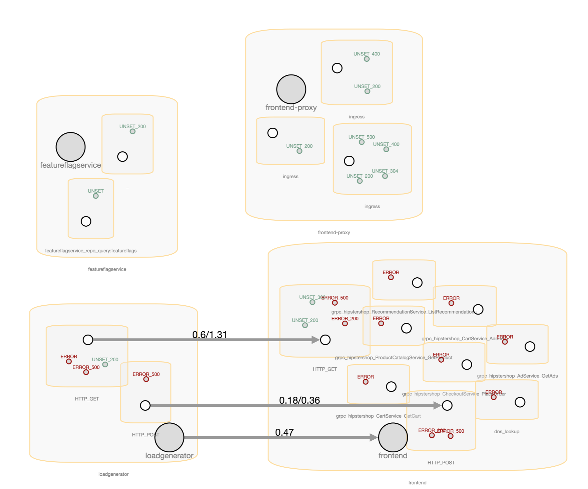
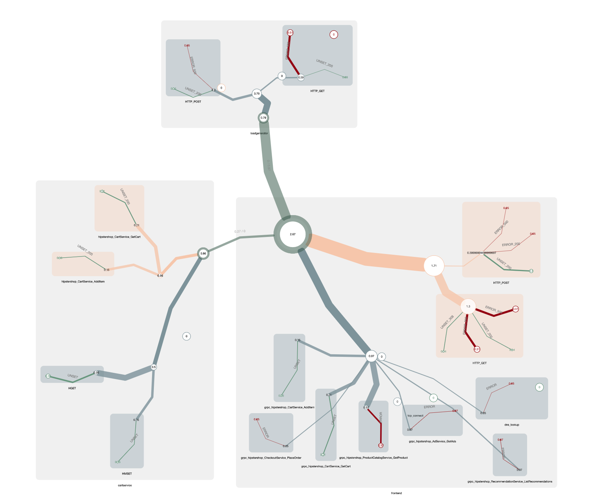
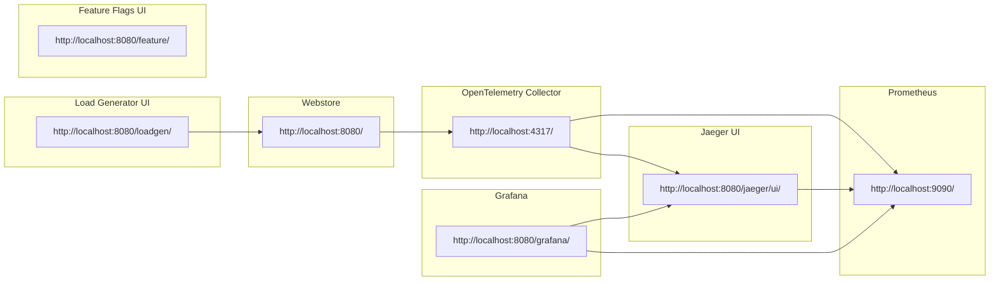

# Shahmaran branch

This branch is reflection of the [Shahmaran](https://tractatus.one/shahmaran-20a9f1678) blog post. Mainly prototyping the ideas and concepts described in the blog post.

## Topological Capabilities and Limitations of Spanmetrics and Servicegraph Processors

explore the topological capabilities and limitations of the spanmetrics and servicegraph processors available in the opentelemetry contrib library. I will examine their usefulness in visualizing the shape of our system and consider what additional features and functionality we might desire in the future.

### Cytoscape on Grafana Preview 
##### 18 Feb 2023

#### Gallery of images from the
[Shahmaran](https://tractatus.one/shahmaran-20a9f1678) blog post.

[footstep snapshots here here](src/servicetopology/footsteps/)
##### A quick look behind the curtain

