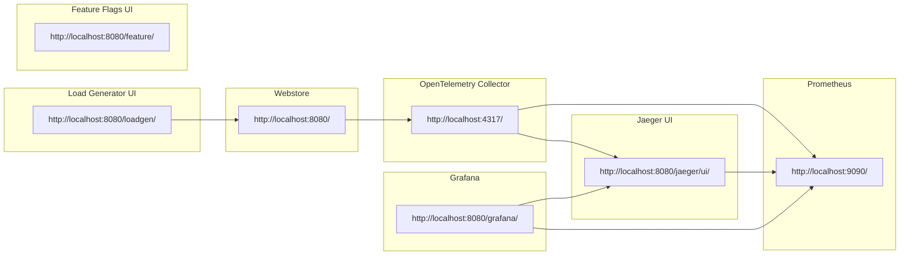

Notes --> [Shamaran](https://medium.com/@devrim.demiroz/shahmaran-20a9f1678)


Here I explore the topological capabilities and limitations of the spanmetrics and servicegraph processors available in the opentelemetry contrib library. 
I will examine their usefulness in visualizing the shape of our system and consider what additional features and functionality we might desire in the future.


* Webstore: http://localhost:8080/
* Grafana: http://localhost:8080/grafana/
* Feature Flags UI: http://localhost:8080/feature/
* Load Generator UI: http://localhost:8080/loadgen/
* Jaeger UI: http://localhost:8080/jaeger/ui/


// TODO place the weblinks in documentation into boxes as clikable links

```shell
# rebuild frontend-proxy and update the image and start
cd ../../../
docker-compose up --build -d frontendproxy >/dev/null &
```

```shell
docker compose up >/dev/null &


```
