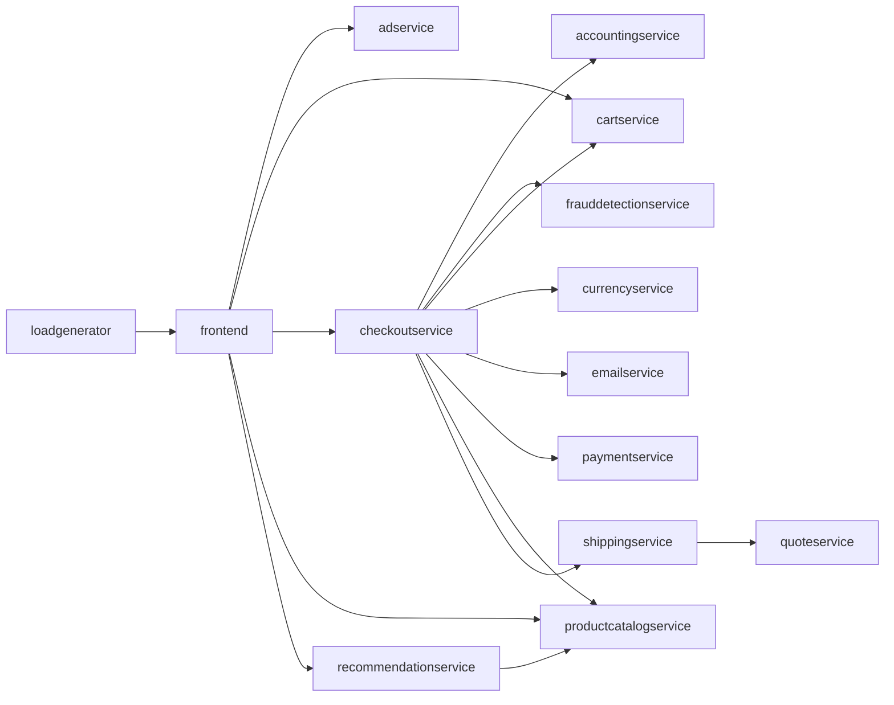

```mermaid

graph LR
  checkoutservice --> accountingservice
  checkoutservice --> frauddetectionservice
  checkoutservice --> cartservice
  checkoutservice --> currencyservice
  checkoutservice --> emailservice
  checkoutservice --> paymentservice
  checkoutservice --> productcatalogservice
  checkoutservice --> shippingservice
  frontend --> adservice
  frontend --> cartservice
  frontend --> checkoutservice
  frontend --> productcatalogservice
  frontend --> recommendationservice
  loadgenerator --> frontend
  recommendationservice --> productcatalogservice
  shippingservice --> quoteservice
  checkoutservice[checkoutservice]
  accountingservice[accountingservice]
  frauddetectionservice[frauddetectionservice]
  cartservice[cartservice]
  currencyservice[currencyservice]
  emailservice[emailservice]
  paymentservice[paymentservice]
  productcatalogservice[productcatalogservice]
  shippingservice[shippingservice]
  frontend[frontend]
  adservice[adservice]
  recommendationservice[recommendationservice]
  loadgenerator[loadgenerator]
  quoteservice[quoteservice]

```
