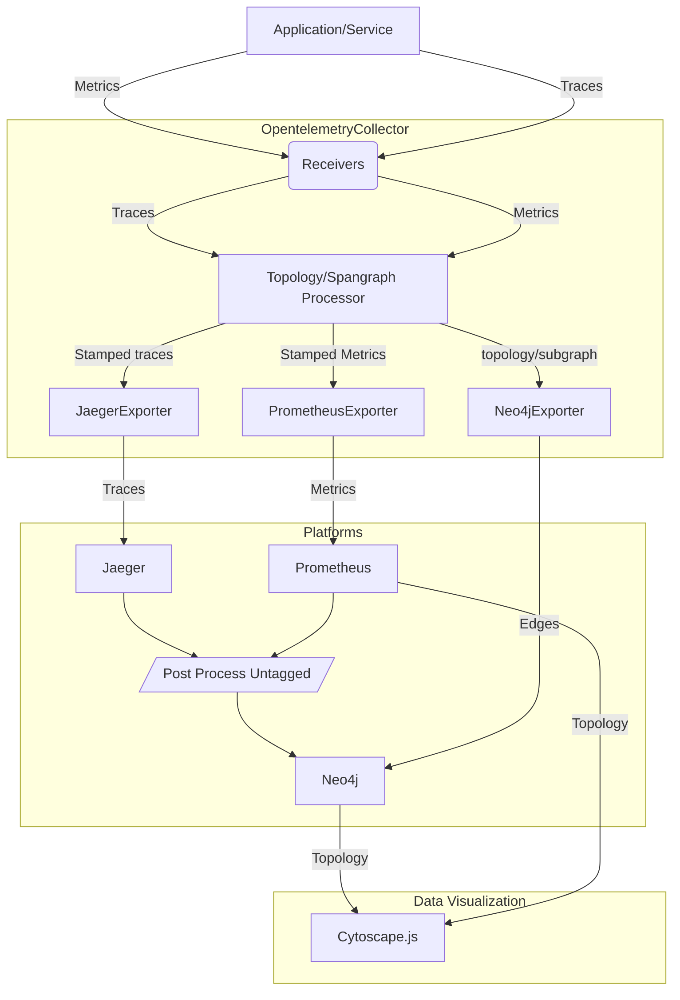
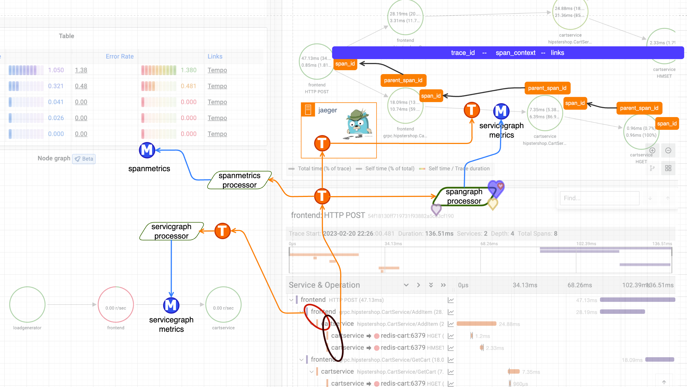

# Opentelemetry Collector Topology Processor

### Prolouge
#### _Fear of the Cardinality_

SpanGraph Processor, the very name

May strike fear in some, a sense of shame

But fear not, for its power lies

In its ability to visualize

A graph of your spans,  Connecting the dots, Revealing dark spots!

# I. Introduction

Modern software systems are increasingly complex, often comprising many interconnected components that span multiple machines and networks. As a result, it can be challenging to understand the overall structure of such systems, let alone monitor their performance and diagnose problems. While metrics and traces are commonly used to measure and analyze system behavior, they can be difficult to visualize in a way that captures the system's underlying topology and temporal dynamics. In response to this challenge, we propose a research intention to develop a method for extracting topology from metrics and traces and visualizing it in a meaningful and informative way. By doing so, we aim to provide system operators and developers with a more effective and efficient way to understand system behavior and diagnose issues, potentially saving time and resources while improving system performance and reliability.

The key research questions we seek to address include: (1) How can topology be extracted from metrics and traces in a time-efficient manner? (2) How can this topology be visualized in a way that is both accurate and comprehensible? By answering these questions, we hope to make a significant contribution to the field of software engineering and systems monitoring, and provide a valuable tool for system operators, developers, and researchers.

# II. Related Work

Several open-source tools exist for monitoring and observability in distributed systems, such as Prometheus, Jaeger, and OpenTelemetry. Prometheus is a widely used time-series database that collects and stores metrics from various sources, while Jaeger is a distributed tracing system that helps in analyzing and troubleshooting microservices-based distributed systems. OpenTelemetry is a vendor-neutral observability framework that provides a standard way of collecting and managing telemetry data from various sources.

To visualize the topology of distributed systems, various approaches have been proposed. One popular approach is to use graph databases such as Neo4j, which provide a flexible way of storing and querying graph data. Another approach is to use visualization libraries such as Cytoscape, which provide an easy way of visualizing graphs and networks.

In the context of extracting topology from metrics and traces, there has been limited research. However, there have been efforts to correlate metrics and traces for better observability, such as the use of distributed tracing for monitoring microservices-based applications. Our approach builds on these efforts by extracting the topology of the distributed system from metrics and traces, and representing it visually using Cytoscape.

The OpenTelemetry Collector is a powerful tool for processing, filtering, and exporting telemetry data. We plan to use the Collector to collect and filter metrics and traces from various sources, including Prometheus and Jaeger. We will then use a graph database to store the extracted topology data and use Cytoscape to visualize it.

Overall, our approach is unique in its focus on extracting topology information from telemetry data and representing it visually. By doing so, we aim to provide a more intuitive and comprehensive view of distributed systems for better observability and troubleshooting.

# III. Methodology

## A. Data Collection

We collect metrics and traces using Prometheus and OpenTelemetry, respectively. Prometheus is a widely-used time-series database that provides a rich set of metrics for various services and applications. OpenTelemetry is an open-source observability framework that provides a vendor-agnostic and standard way of collecting telemetry data. By using Prometheus and OpenTelemetry together, we can collect and correlate both metric and trace data for constructing the topology graph.

## B. Data Processing

The collected metric and trace data needs to be processed to extract the relevant topology information. To reduce the number of traces, we will build a "spangraph processor" on top of OpenTelemetry Collector. This processor will analyze the span data and attach topology information to the span metrics, which can be used to construct subgraphs.

We will also use the OpenTelemetry Collector to enrich the span data with additional contextual information such as service and operation names, error codes, and other relevant metadata. This will help in constructing a more detailed and accurate topology graph.

## C. Topology Extraction

Once the metric and trace data has been processed, we can extract the topology information using various techniques. We will use a combination of aggregation, clustering, and span folding to extract the relevant topology information from the metric and trace data.

Aggregation involves grouping similar nodes together based on their attributes and metrics. Clustering is a technique that groups nodes based on their connectivity and similarities. Span folding is a technique that aggregates the span data to reduce the number of traces and attach the relevant topology information to the span metrics.

## D. Topology Visualization

The extracted topology information can be visualized using graph visualization tools such as Cytoscape. Cytoscape is an open-source platform for visualizing complex networks and can be used to create interactive and customizable topology graphs.

The topology graph can be further refined by applying various layout algorithms and filtering techniques. The graph can be explored and interacted with to gain insights into the system's architecture and behavior.

## E. Best Effort

To deal with the high cardinality issue of trace data, we will adopt a best effort approach for constructing subgraphs. By attaching topology information to metrics on the collector level and sampling traces less, we can reduce the number of traces to a manageable size while still providing useful subgraphs for constructing smaller topologies.

This methodology provides a scalable and efficient way to extract and visualize topology information from metric and trace data. The use of OpenTelemetry, Prometheus, and Cytoscape provides a vendor-agnostic and open-source solution for observability and visualization. The methodology can be applied to various systems and applications for analyzing their architecture and behavior.

### Graphdb or Just Metrics? In a nutshell

Here are some potential pros and cons for each approach:

Putting edge information on metrics:

#### Pros:

The data is already in a format that can be easily ingested by tools like Prometheus and Grafana.
It may require less engineering effort, as it does not require building a separate data pipeline for exporting to a graph database.
It may be more suitable for small-scale systems where the increase in cardinality is not a significant concern.

#### Cons:

It could lead to high cardinality, which may result in performance issues and increased storage costs.
It may not be as suitable for complex graph queries that may require traversing multiple nodes and edges.
Exporting to a graph database on the collector level:

#### Pros:

It allows for more advanced graph queries, such as finding paths between nodes, detecting cycles, and identifying communities.
It can help reduce the cardinality of the metrics data, as edge information does not need to be included in the metrics.
It can provide a more scalable and flexible solution for large-scale systems.

####  Cons:

It requires additional engineering effort to build a data pipeline for exporting the data to a graph database.
It may require additional resources and maintenance to manage the graph database.
It may not be as suitable for real-time monitoring, as there may be latency in updating the graph database.
Overall, the best approach may depend on the specific use case and the trade-offs between performance, scalability, and engineering effort.

### Best Effort + Post Processing
When exporting to Neo4j at the collector level, it is difficult to determine which spans/spanmetrics have not been added as topology information. This can result in redundant data processing and slower data analysis.

**i)** One approach to address this problem is to use a label or annotation on the spans or spanmetrics to indicate that topology information has been added. This can help in the efficient identification of processed and unprocessed data, enabling quicker data analysis.

**ii)** Additionally, it may be useful to include a timestamp or metadata when exporting to Neo4j, which indicates when the topology information was added. This can help in identifying any inconsistencies or issues that may arise when merging data from different sources.

Both solutions can be effectively used together to ensure accurate and up-to-date topology information. This would result in faster and more efficient data processing, enabling quicker decision-making.

# IV. Expected Results

- The ability to visualize the topology of a distributed system using graph-based representations, which can help identify performance bottlenecks and failures in the system.

- The reduction of the number of traces needed to construct the topology, which can help reduce the storage and processing costs of tracing systems.
The ability to identify temporal patterns in the behavior of the distributed system, such as changes in the frequency of errors or changes in the latency of requests.

- The ability to perform predictive maintenance on the distributed system by identifying potential performance bottlenecks before they occur.

- The development of new approaches to integrating tracing and monitoring systems, which can help reduce the complexity of managing large-scale distributed systems.

# V. Conclusion

In this research intention, we have presented a methodology for extracting topology from metrics and traces and visually representing it as a pathway. The proposed methodology leverages OpenTelemetry for collecting metrics and traces, Prometheus for storing and querying metrics, and Jaeger for distributed tracing. We have also proposed a Spangraph processor for reducing the number of traces, but attaching topology information to span metrics. Furthermore, we have discussed two possible approaches for storing and visualizing the topology graph, one using Prometheus metrics with attached edge information, and the other using a Neo4j exporter on the OpenTelemetry collector.

We assume that the proposed methodology would result in a compact and meaningful representation of the system topology, which can provide valuable insights into system behavior, performance, and fault detection. By leveraging the power of OpenTelemetry and Prometheus, we can efficiently extract metrics and traces, and by using Jaeger, we can derive edge information between nodes. By adopting the Spangraph processor, we can reduce the number of traces while still maintaining the essential topology information. Finally, by using a graph database such as Neo4j, we can store and visualize the topology graph with high performance and scalability.

However, there are still many open questions and challenges that need to be addressed. For example, how to efficiently handle high cardinality edge information and how to adapt the methodology to different system architectures and use cases. Therefore, we believe that further research and experimentation are needed to validate the proposed methodology and explore its limitations and potentials.

## As The Reference

 

