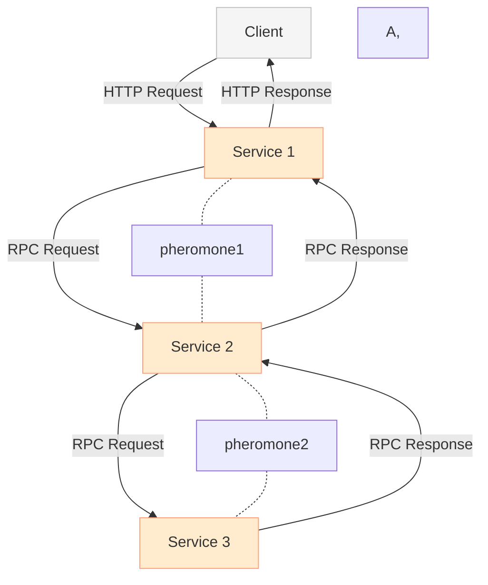

# Using Pheromones, OpenTelemetry, and Other Metrics for Efficient Routing in Distributed Systems

## Introduction:
Distributed systems are increasingly common in modern computing, allowing organizations to process large amounts of data and provide scalable, fault-tolerant services. However, ensuring efficient routing and optimal resource usage in these systems can be challenging, as requests may need to traverse multiple nodes and routes in order to be processed. One potential solution is to use pheromones, OpenTelemetry, and other metrics to guide routing decisions, helping to optimize resource usage and improve overall system efficiency.

## Background

### Ant Colony Optimization
Ant Colony Optimization is a metaheuristic optimization algorithm inspired by the foraging behavior of ants. In nature, ants deposit pheromones on the ground as they travel, which creates a trail for other ants to follow. The more ants that travel a particular path, the stronger the pheromone trail becomes, making it more likely for other ants to follow that path as well. Over time, the ant colony will converge on the shortest path between the nest and the food source, as more and more ants follow the shortest path and deposit pheromones on it.

In computer science, ACO has been applied to various optimization problems, such as the Traveling Salesman Problem and the Vehicle Routing Problem. ACO algorithms typically involve constructing a graph to represent the problem, where the nodes represent possible solutions and the edges represent the cost or quality of transitioning between solutions. In each iteration of the algorithm, a set of artificial ants is sent out to explore the graph and deposit pheromones on the edges based on the quality of the solutions they find. The pheromone levels on each edge are then updated based on the quality of the solutions found by all the ants, and the ants are sent out again to explore the graph. Over time, the pheromone trail converges on the best solution, as more and more ants follow the path with the highest pheromone levels.

In the context of distributed systems and network optimization, the idea of using pheromones to guide requests is similar to the idea of ACO. By allowing agents to deposit pheromones on certain paths based on their experience, we can guide future requests towards the paths with the highest quality of service. The use of OpenTelemetry and distributed tracing tools allows us to track the paths taken by requests and collect information about their performance, which can be used to update the pheromone levels on each path. By using this approach, we can optimize the performance of our distributed systems without relying on centralized routing or load balancing systems.

### Distributed Tracing and OpenTelemetry
OpenTelemetry is a relatively new project that aims to provide a standardized approach to collecting, processing, and exporting telemetry data from distributed systems. It was first introduced in 2019, and since then it has gained significant traction and adoption within the software development community. The project is supported by major cloud providers such as Google, Microsoft, and AWS, as well as many other organizations and individual contributors.

OpenTelemetry has had a significant impact on the way telemetry data is collected and used in distributed systems. 

Prior to OpenTelemetry, there were many different telemetry frameworks and tools available, each with its own set of features and limitations. This made it difficult to build a comprehensive and unified view of system performance across multiple services and environments.

With OpenTelemetry, developers can instrument their code using a set of standard APIs and libraries, which allows telemetry data to be collected and exported in a vendor-neutral format. This makes it much easier to integrate telemetry data from multiple sources, and to build custom monitoring and alerting systems that are tailored to the specific needs of a particular organization or application.

The growth of OpenTelemetry has also created many new opportunities for innovation and collaboration in the telemetry space. With a standardized approach to collecting telemetry data, developers and organizations can more easily share best practices and tools, and build new applications and services that leverage telemetry data in novel and useful ways. This has the potential to lead to significant improvements in system performance, reliability, and resilience, as well as to new insights and discoveries about how distributed systems work.

## Using Pheromones and OpenTelemetry for Routing
Pheromones are chemical signals used by ants and other insects to communicate with each other, allowing them to navigate complex environments and find optimal routes to food sources. In distributed systems, pheromones can be used as a metric to guide routing decisions, allowing agents or requests to choose routes that have been marked with higher levels of pheromones.

OpenTelemetry is a vendor-neutral, open-source project that provides a framework for collecting, processing, and exporting telemetry data, such as distributed traces, metrics, and logs. In distributed systems, OpenTelemetry can be used to capture distributed traces, which allow developers to track the flow of requests through a system and identify performance issues.

Using distributed tracing with OpenTelemetry, agents or requests can capture trace IDs and span IDs, which can be used in combination with pheromone IDs to guide routing decisions. For example, in a distributed system with multiple nodes and routes, nodes that respond faster or have better network latency may produce more pheromones over time, indicating to agents or requests that they are a better option for routing requests. Additionally, agents or requests can use span statuses to identify nodes that are experiencing high resource utilization or downtime, and avoid these nodes in favor of more efficient and reliable routes.

This diagram shows the same system architecture as before, but with the addition of trace and pheromone data. The trace data is represented by the solid lines labeled with trace IDs, which indicate the path that a request takes through the system. The pheromone data is represented by the dashed lines labeled with pheromone IDs, which indicate the strength of the "trail" left by previous requests.

As requests flow through the system, they generate trace data that is collected and aggregated by OpenTelemetry. This data can be used to analyze system performance, diagnose issues, and optimize resource utilization. In addition, the pheromone data generated by each request can be used to guide future routing decisions, by allowing the client to choose the path with the strongest pheromone trail (i.e. the path that has been traversed by the most successful requests).

##  Advantages and Potential Problems
Using pheromones, OpenTelemetry, and other metrics for routing decisions in distributed systems has several advantages, including improved resource optimization, fault-tolerance, and cost reduction. By using distributed tracing with OpenTelemetry, organizations can identify and diagnose performance issues, allowing them to optimize routing decisions in real-time.

However, there are also potential problems to consider, such as false positives, limited scalability, and over-reliance on certain nodes or routes. As such, it's important to use these metrics in combination with other factors and to continually monitor and adjust the system to ensure optimal performance and efficiency.

## Conclusion
Overall, using pheromones, OpenTelemetry, and other metrics for routing decisions can be a valuable tool for optimizing resource usage and improving overall system efficiency in distributed systems. By carefully monitoring and adjusting these metrics, organizations can ensure that requests are processed reliably and efficiently, while also minimizing unnecessary costs and ensuring fault-tolerance and scalability. With the help of distributed tracing and OpenTelemetry, organizations can capture detailed telemetry data and diagnose performance issues, allowing them to make data-driven decisions about routing and resource allocation.

## References
- "A survey of ant colony optimization for routing optimization in communication networks" by A.A. Mekky and A.A. El-Fergany. This paper provides an overview of the use of ACO for routing optimization in communication networks, including both wired and wireless networks.
- "Ant colony optimization for scheduling in cloud computing: A survey" by T. Abdullah and A. Gani. This paper discusses the use of ACO for scheduling tasks in cloud computing environments, with a focus on minimizing resource utilization and maximizing energy efficiency.
- "Ant Colony Optimization for the Traveling Salesman Problem with Time Windows" by M. Dorigo, V. Maniezzo, and A. Colorni. This paper describes an application of ACO to the Traveling Salesman Problem with Time Windows, a classic optimization problem in which a salesman must visit a set of cities within a specified time frame.
- "A multi-objective ant colony optimization algorithm for job scheduling in cloud computing" by X. Zhou, Y. Huang, and Z. Zhang. This paper presents a multi-objective ACO algorithm for job scheduling in cloud computing, which considers both makespan and energy consumption as optimization objectives.
- "Ant Colony Optimization in Wireless Sensor Networks: Applications and Challenges" by S. Sultana and S. Islam. This paper provides an overview of the use of ACO in wireless sensor networks, with a focus on routing optimization, energy efficiency, and network lifetime.

